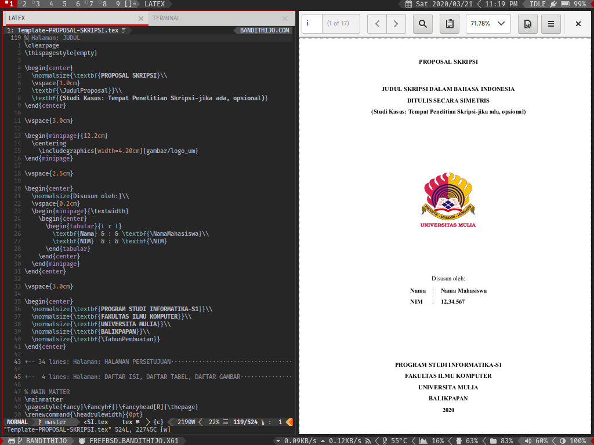
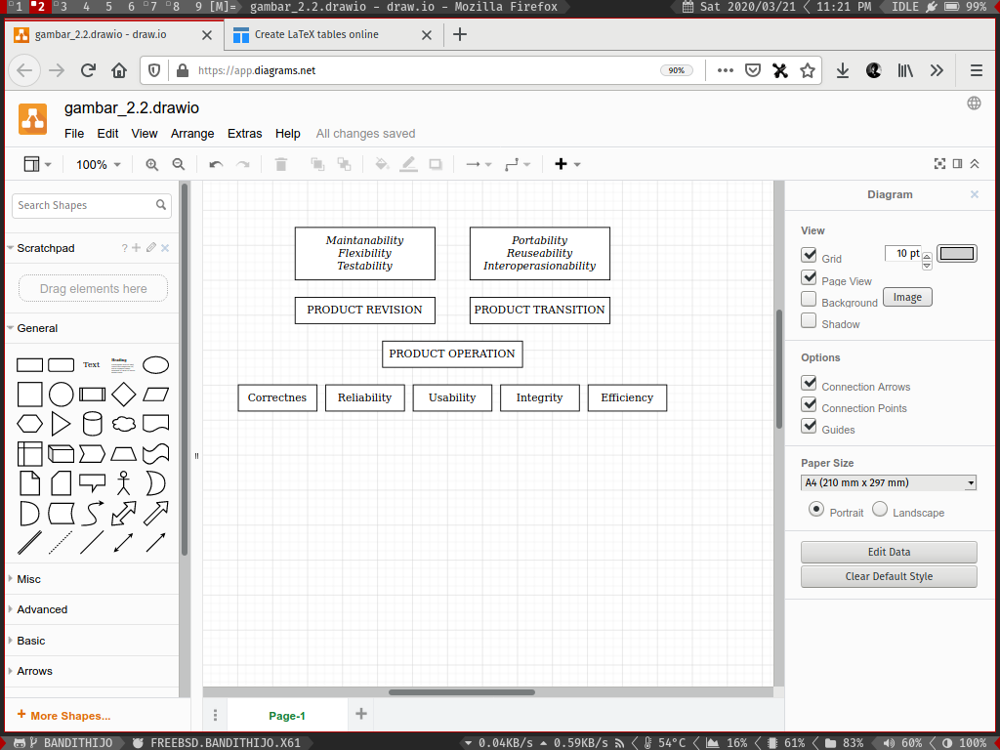
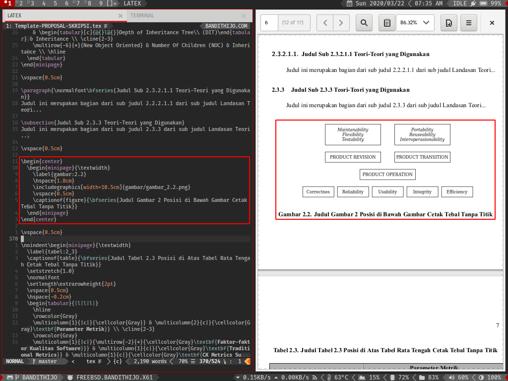
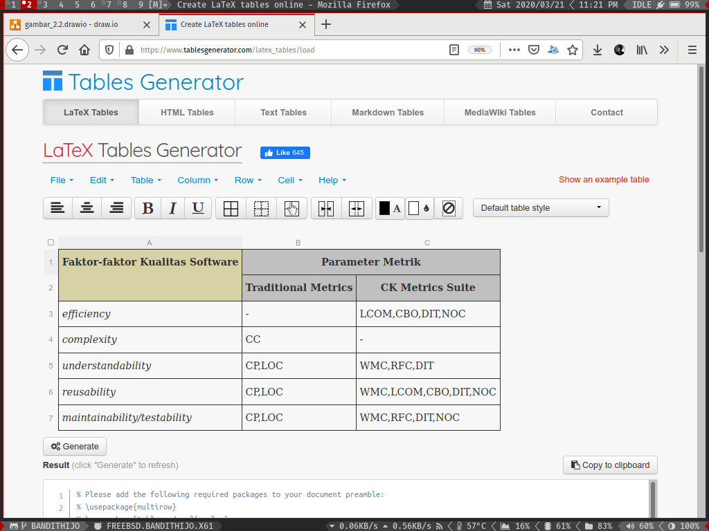
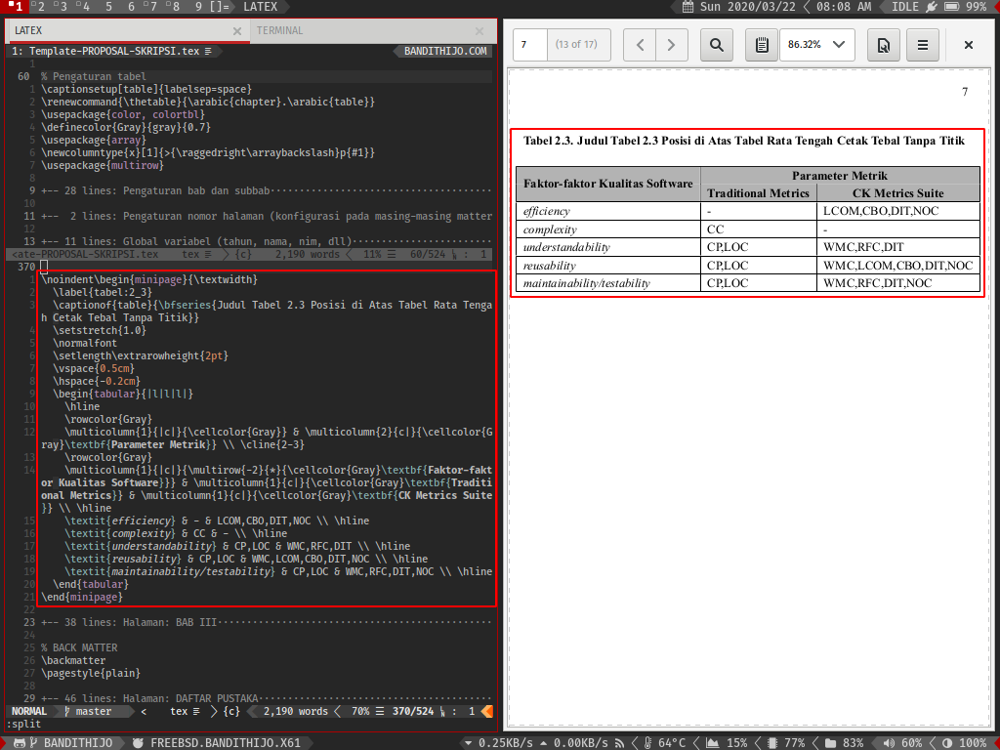

# Kumpulan Template Laporan KP, Proposal, Skripsi - Program Studi Informatika S1 - Fakultas Ilmu Komputer - Universitas Mulia Balikpapan (Unofficial) (LaTeX version)

## Project Apa Ini?

Ini adalah kumpulan template untuk membuat dokumen akademik, baik **Laporan Kerja Praktek**, **Proposal Skripsi**, dan **Skripsi**.

## Apakah proyek ini resmi dari kampus?

Tidak. Proyek ini dibuat atas inisiatif sendiri. Saat ini kampus hanya menyediakan format Microsoft Word.

## Apa tujuan proyek ini dibuat?

Untuk memudahkan teman-teman programmer dalam membuat dokumen tanpa perlu membuat dari awal kembali. Sebagai seorang programmer, pasti lebih suka bekerja menggunakan *text editor* daripada Microsoft Word. Karena template ini dibuat menggunakan format LaTeX yang akan memudahkan teman-teman programmer dalam menulis dokumen. Proses pembuatan dokumen pasti akan terasa lebih mneyenangkan karena kita dapat menggunakan *snippets*, *autocompletion*, dan fitur-fitur lain dari *text editor* favorit kita.

## Seperti apa proses menulis dokumen pada template yang dibuat menggunakan LaTeX?

Proses menulis akan tergantung dari *tools* yang dipergunakan. Saya secara pribadi menggunakan **Vim** *text editor*. Dan menggunkaan PDF reader seperti **Evince** pada sistem operasi **FreeBSD** untuk menulis.



Tentu saja teman-teman tidak harus menggunakan *tools* yang sama. Teman-teman dapat menggunakan LaTeX IDE yang tentu saja lebih mudah dipergunakan, seperti: **Texmaker** atau **TeXstudio**.

## Apakah harus menggunakan FreeBSD / GNU/Linux?

Tentu tidak.

Meskipun saya belum pernah menggunakan LaTeX pada sistem operasi Windows, tapi saya yakin, bisa. Karena saya pernah beberapa kali melihat tutorial di YouTube, teman-teman yang menggunakan LaTeX pada sistem operasi Windows.

## Bagaimana proses membuat bagan atau menambahkan gambar?

Untuk Membuat bagan, saya menggunakan *web app* seperti [**draw.io**](https://app.diagrams.net/).



Kemudian saya menggunkanan package **pgf**, **tikz**, dan **caption**.

```tex
\usepackage{pgf,tikz}
\usepackage{caption}
```

Lalu tinggal digunakan pada `document` seperti ini.

```tex
\begin{center}
  \begin{minipage}{\textwidth}
    \label{gambar:2.1}
    \includegraphics[width=13.5cm]{gambar/gambar_2.1.png}
    \vspace{0.5cm}
    \captionof{figure}{\bfseries{Judul Gambar Posisi di Bawah Gambar Cetak Tebal}}
  \end{minipage}
\end{center}
```



## Bagaimana proses membuat tabel?

Untuk membuat tabel, saya juga menggunakan *web app* seperti [*tablesgenerator.com*](https://www.tablesgenerator.com/latex_tables).



Kemudian saya menggunakan package

```tex
\usepackage{color, colortbl}
\definecolor{Gray}{gray}{0.7}
\usepackage{array}
\usepackage{multirow}
```

Lalu tinggal digunakan pada `document` seperti ini.

```tex
\noindent\begin{minipage}{\textwidth}
  \label{tabel:2_3}
  \captionof{table}{\bfseries{Judul Tabel 2.3 Posisi di Atas Tabel Rata Tengah Cetak Tebal Tanpa Titik}}
  \begin{tabular}{|l|l|l|}
    \hline
    \rowcolor{Gray}
    \multicolumn{1}{|c|}{\cellcolor{Gray}} & \multicolumn{2}{c|}{\cellcolor{Gray}\textbf{Parameter Metrik}} \\ \cline{2-3}
    \rowcolor{Gray}
    \multicolumn{1}{|c|}{\multirow{-2}{*}{\cellcolor{Gray}\textbf{Faktor-faktor Kualitas Software}}} & \multicolumn{1}{c|}{\cellcolor{Gray}\textbf{Traditional Metrics}} & \multicolumn{1}{c|}{\cellcolor{Gray}\textbf{CK Metrics Suite}} \\ \hline
    \textit{efficiency} & - & LCOM,CBO,DIT,NOC \\ \hline
    \textit{complexity} & CC & - \\ \hline
    \textit{understandability} & CP,LOC & WMC,RFC,DIT \\ \hline
    \textit{reusability} & CP,LOC & WMC,LCOM,CBO,DIT,NOC \\ \hline
    \textit{maintainability/testability} & CP,LOC & WMC,RFC,DIT,NOC \\ \hline
  \end{tabular}
\end{minipage}
```



## Saya ingin ikut berkontribusi, bagaimana caranya?

Saya sangat menerima dengan senang hati apabila ada teman-teman satu almamater yang ingin ikut berkontribusi untuk membuat proyek ini menjadi lebih baik.

Caranya sangat mudah, cukup buat **Pull Request**, lalu deskripsikan *pull request* kamu dengan baik dan jelas yaa. Nanti kita akan diskusikan di sana.

**Kalau bukan satu almamater, apa boleh?**

Boleh, tentu saja.

Saya sangat senang ada teman-teman di luar almamater yang ingin ikut berkontribusi dalam proyek ini.
